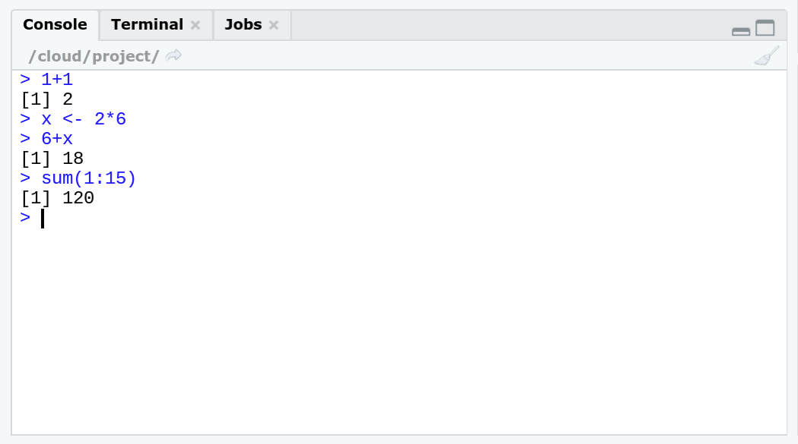

# Oberflaeche

## R GUI

Mit der Installation von R wird gleichzeitig ein *Graphical User Interface* (GUI)
mitinstalliert. Hier können wir bereits R Code eingeben und mit `Enter` an den 
Computer übergeben. In der nächsten Zeile wird die Antwort vom Computer an uns
zurückgegeben.

```{r, echo=FALSE, out.width='80%', fig.align='center', fig.cap="R GUI"}
knitr::include_graphics("resources/GUI.png")
```

Diese Oberfläche ist jedoch wenig "komfortabel". Sie bietet keine zusätzlichen Editoren oder Fenster, um z.B. die gespeicherten Objekte oder Graphiken anzuzeigen.

## RStudio

```{r, echo=FALSE, out.width='60%', fig.align='center', fig.cap="RStudio Logo (https://www.rstudio.com/about/logos/)"}
knitr::include_graphics("resources/RStudio.png")
```

```{r, echo=FALSE, out.width='80%', fig.align='center', fig.cap="RStudio Interface"}

```

RStudio bietet eine nutzer*innenfreundliche (und freie) Alternative für die Nutzung von R. Hier sind zusätzliche Editoren und Übersichten enthalten. Zu nennen ist beispielsweise:

- Script-Editor
- Übersicht über Objekte in globaler Umgebung 
- Übersicht über Packages
- Einfache Dateienhandhabung durch Projects 
- u.v.m. 

Das Interface von RStudio besteht aus mehreren Fenstern.

### Console

```{r, echo=FALSE, out.width='80%', fig.align='center', fig.cap="Console"}

```

Die R Console dient zur direkten Übergabe von Ausdrücken bzw. Funktionen an R 
und ist identisch mit der Anzeige in der R GUI. Diese eignet sich für 
kleine Tasks bzw. Tests. Das Ergebnis wird direkt unterhalb des Befehls angezeigt.
Außerderm werden Ergebnisse aus den Scripten, die keine Graphiken sind, 
hier angezeigt.

Nachdem Code hier eingetippt wurde, wird die Befehlszeile mit der Taste
`ENTER` ausgeführt.


### Script Editor

```{r, echo=FALSE, out.width='80%', fig.align='center',fig.cap="Script Editor"}
knitr::include_graphics("resources/editor.png")
```

In der Console kann euer Code langfristig nicht gespeichert werden. Sogenannte R
Scripte ermöglichen euch, euren Code zu speichern und nacheinander auszuführen.

Der entsprechende Editor muss zunächst händisch geöffnet werden:

`File` $\rightarrow$ `New File` $\rightarrow$ `R Script`

Nachdem Code geschrieben wurde, kann der Code mit folgender Tastenkombination 
ausgeführt werden:

`strg + ENTER` (Win) bzw. `command + ENTER` (Mac)

Hierzu genügt es, wenn sich der Cursor in **einer** der Zeilen der Befehlssequenz
befindet. Sollen mehrere Befehlssequenzen ausgeführt werden, müssen diese vorher
markiert werden.

Mit `#` lassen sich Kommentare in das Script schreiben. Zeilen, in denen dieses 
Zeichen steht, werden von R ignoriert und nicht ausgeführt.

### File-Editor und Environment

```{r editor, echo=FALSE,out.width="49%", out.height="20%",fig.cap="File-Editor und Environment-Oberfläche",fig.show='hold',fig.align='center'}
knitr::include_graphics(c("resources/files.png","resources/envi.png"))
```

Zusätzlich zu der Console und dem Skript-Editor bietet RStudio weitere Fenster,
die die Arbeit mit R vereinfachen sollen.

Das Fenster unten rechts (Standardeinstellung, Abbildung \@ref(fig:editor)a) beinhaltet einen **File-Editor** 
(ähnlich zum File Browser (Win) bzw. Finder (Mac)). Hier können Dateien und 
Verzeichnisstrukturen angesehen und bearbeitet werden (neuer Ordner, Umbenennen
von Dateien). Außerdem werden hier **Graphiken angezeigt**, wenn diese über Code in
Scripten oder in der Console erzeugt werden. Des Weiteren gibt es hier eine 
**Übersicht über Packages** und das **Help** Fenster.

Oben rechts (Standardeinstellung, Abbildung \@ref(fig:editor)b) existiert die **Global Environment**, in dem 
alle gespeicherten Objekte angezeigt werden. Schließlich kann hier auf die 
**History** und **Verbindungen**, wie GitHub, zugegriffen werden.

*Video zur Oberfläche von RStudio:*

```{r, echo=FALSE}
knitr::include_url("https://videocampus.urz.uni-leipzig.de/paella/ui/watch.html?id=753da1a0-535c-4afb-8a84-dbf3c200be7f")
```

## Prüfe dich selbst

Von dieser Sitzung solltest du folgendes mitgenommen haben: 

- [x] Du solltest die wesentliche Funktionsweise von R verstanden haben.
- [x] Du solltest den Aufbau von RStudio kennen.
- [x] Du solltest wissen, was ein Script ist und wie es geöffnet werden kann.
- [x] Du solltest wissen, wie Befehlssequenzen in der Console und in einem Script ausgeführt werden.
