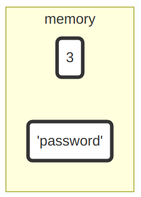
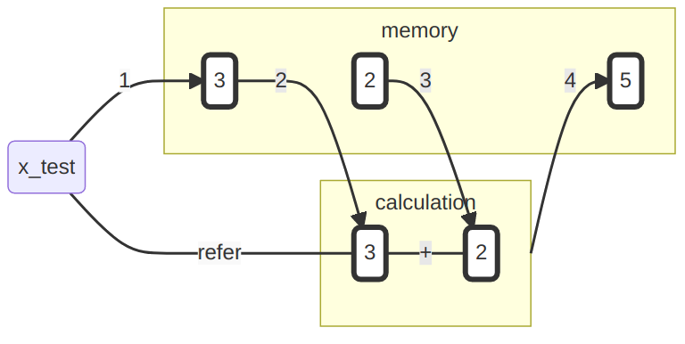
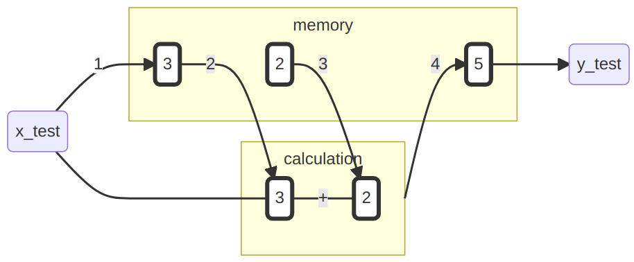
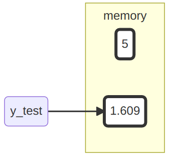

# Atomare Datentypen 

Datentypen sind die Grundlage einer jeden Programmiersprache und somit essenziell zum Verständnis dieser. Sie dienen dazu, verschiedene Typen zu unterscheiden, wie etwa Zahlen von Buchstaben. Das ist besonders wichtig, da wir mit unterschiedlichen 'Typen' unterschiedliche Operationen ausführen bzw. nicht ausführen können. Zum Beispiel können wir mit Zahlen rechnen, mit Buchstaben hingegen nicht. Mit logischen Bedingungen können wir wiederum Wahrheitswerte ermitteln, mit Zahlen hingegen nicht. Zu wissen, welche Eigenschaften die verschiedenen Datentypen haben und welche Operationen mit diesen möglich sind, hilft dabei, vielen potenziellen Fehlern vorzubeugen und so Frustration zu vermeiden. 


Zunächst einmal wollen wir uns die atomaren Datentypen anschauen. Diese bilden die Grundlage aller folgenden Datenstrukturen.

Datentyp              Beschreibung                            Beispiel 
-------------------   -------------------------------------  ----------
integer               ganze Zahlen                            -2L       
numeric               rationale Zahlen                        5.2456   
logical               logische Werte                          TRUE     
character             Zeichenfolge                           "Mexico" 
NA,NULL,NaN           unbestimmt, leer, undefiniert                    
Inf                   unendlich                                        

Die numerischen Datentypen `integer` und `numeric` erlauben es, numerische Informationen zu repräsentieren. Mit dem Datentyp `logical` können logische Informationen repräsentiert werden. Um symbolische Informationen zu repräsentieren, verwenden wir den Datentyp `character`. Mit numerischen, logischen und symbolischen Informationen ist es bereits möglich, eine Vielzahl von Sachverhalten auszudrücken. Was dies sein kann, wollen wir uns im Folgenden anschauen.

## Arithmetische Grundoperationen und Basisfunktionen

R beherrscht für alle  Zahlen die arithmetischen Grundoperationen und eignet sich somit wunderbar als Taschenrechner.

  Operation     Beschreibung                          Beispiel  
  ----------    --------------------------            ---------
  `+,-`         Addition, Subtraktion                 `3-1.2` 
  `*,/`         Multiplikation, Division              `4.8/4`
  `^`           Potenz                                `5^2`
 
Beispiel:
```{r}
1+2

2*3.5

10.1^3

```

 
R verfügt für Daten numerischen Typs über viele elementare Grundfunktionen.
 Hier nur ein paar wenige relevante Beispiele:
 
  Operation         Beschreibung                           Beispiel  
  --------------    -------------------------------------- ---------
  `sqrt()`          Quadratwurzel                          `sqrt(9)`
  `abs()`           Absolutbetrag                          `abs(-12)`
  `log(),exp()`     Logarithmus und Expontentialfunktion   `exp(3)`
  `round()`         Runden                                 `round(2.12)`
 
```{r}
sqrt(5)
log(3)
```

### Funktionsaufrufe  

Funktionen sind ein wichtiger Teil von R und werden syntaktisch durch eine öffnende und eine schließende Klammer gekennzeichnet, nach diesem Schema: `funktion()`. Gerade haben wir bereits eine Funktion ausgeführt, indem wir `sqrt(9)` aufgerufen haben. Ausführlich werden Funktionen noch in Kapitel \@ref(funktionen) besprochen. Ein paar Grundlagen wollen wir hier aber schon einmal einführen:

Funktionsaufrufe erfolgen in der Regel über das Schema
 
`Funktionsname(Argument 1, Argument 2, ...)`
 
Beispiel: Die Funktion

`signif(x,digits)`
 
rundet eine Zahl `x` auf `digits` signifikante Stellen.
 
1.  Argumente haben zumeist einen festen Namen, sodass diesen eindeutig Werte 
    zugewiesen werden können:
 
```{r}
  signif(x = 12.3456, digits = 3)
```
  
 
2. Alternativ können aufgrund der Position bzw. der Ordnung den Argumenten Werte zugewiesen werden: 

```{r}
  signif(12.3456, 3)
```


### Objekte, Funktionen und Referenzen

“To understand computations in R, two slogans are helpful: Everything that exists is an object. Everything that happens is a function call.”  (John M. Chambers) [^2] 

[^2]: https://de.wikipedia.org/wiki/R_%28Programmiersprache%29

\bigskip

  - Funktionen haben wir gerade kennengelernt, also kennen wir auch schon "Everything that happens".
  - Objekte haben wir auch schon durchgehend verwendet.
  
Geben wir etwa `3` oder `"password"` in die Konsole ein, wird ein entsprechendes Objekt im Speicher erzeugt. 

```{r, echo=FALSE, out.width='20%', fig.align='center'}

```

Auf diese Objekte haben wir allerdings anschließend keinen Zugriff mehr. Wenn wir jetzt zum Beispiel erneut die Zeichenkette `"password"` benötigten, müssten wir sie auch erneut eintippen. Wie es ändern können, dass uns Objekte längerfristig zur Verfügung stehen, wollen wir uns jetzt anschauen.

## Erzeugung von referenzierbaren Objekten

Mit dem Operator `<-` lässt sich ein referenzierbares Objekt erstellen. Das bedeutet, dass das Objekt an einen Namen gebunden wird:


```{r}
 x_test <- 3
```

Das Objekt lässt sich nun über den Namen aus dem Speicher abrufen:

```{r}
x_test
```

Wenn wir 

```{r}
 x_test <- 3
```

ausführen, passiert formal eigentlich Folgendes:

1.  Es wird im Speicher ein Objekt mit dem Wert 3 erzeugt.
2.  Es wird der Name `x_test` an dieses Objekt gebunden, sodass zu diesem Objekt
    mit dem Namen `x_test` referiert werden kann bzw. bei Aufruf von `x_test` 
    der Wert zurückgegeben wird.

```{r, echo=FALSE, out.width='55%', fig.align='center'}
knitr::include_graphics("resources/2_assign_object.png")
```

Über den Namen, welcher nun an das Objekt gebunden ist, können wir dieses jetzt dauerhaft abrufen (referenzieren).

### Anmerkung Namen

Für Namen dürfen alle Buchstaben und Zahlen verwendet werden, sowie 
die beiden Sonderzeichen `_` und `.`, wobei diese nicht
am Anfang stehen dürfen. 

Beispiel:

```{r}
x_1 <- 3
```

Aber:

```{r, message = TRUE, error = TRUE}
_x_1 <- 3
```

**Bemerkung:** Man sollte sich bei den Buchstaben nur auf a,...,z bzw. A,.., Z beschränken, auch wenn je nach lokalem Setting z.B. auch andere Buchstaben wie ä zulässig sind.

### Rechnungen mit Werten von Objekten
 
Das über seinen Namen referenzierbare Objekt steht für alle weiteren 
Berechnungen und Operationen zur Verfügung:

```{r}
x_test + 2
```

```{r, echo=FALSE, out.width='70%', fig.align='center'}

```

Das Ergebnis dieses Ausdrucks ist ein neues numerisches Objekt. Dieses kann für spätere Zwecke erneut an einen Namen gebunden werden:

```{r}
y_test <- x_test + 2

y_test
```

```{r, echo=FALSE, out.width='80%', fig.align='center'}

```


Unser Speicher sieht aktuell so aus:
\vspace{1cm}

```{r, echo=FALSE, out.width='40%', fig.align='center'}
knitr::include_graphics("resources/5_calculation_left_over.png")
```

Zwar haben wir für die Berechnung auch eine zwei im Speicher angelegt, diese ist aber nicht an einen Namen gebunden. Die drei und die fünf hingegen schon. Wenn wir nun `x_test` und `y_test` aufrufen, bekommen wir jeweils das entsprechende Objekt zurück.

### Namen überschreiben
 
ACHTUNG! - Verwendet man denselben Namen noch einmal, geht die ursprüngliche Referenz verloren:

```{r}
y_test <- log(y_test)
```

```{r, echo=FALSE, out.width='70%', fig.align='center'}
knitr::include_graphics("resources/6_reassignmend_part_1.png")
```


Wenn wir jetzt das Objekt zum Namen `y_test` abfragen, sehen wir Folgendes: 

```{r}
y_test
```

Das ursprüngliche Objekt zum Namen `y_test` steht uns nicht mehr zur Verfügung und ist somit unwiederbringlich verloren.

```{r, echo=FALSE, out.width='30%', fig.align='center'}

```

Führt man die Codezeile `y_test <- log(y_test)` jetzt noch einmal aus, so wird `y_test` wieder an ein anderes Objekt gebunden. Durch dieses Verhalten können wir nie sicher vorhersagen, an welches Objekt `y_test` momentan gebunden ist. Deswegen sollte man immer neue Namen vergeben und diese nicht doppelt verwenden.


### Objekte löschen

 Wir haben mittlerweile ein paar Objekte im Speicher
 angelegt und an Namen gebunden. Mit `ls()` kann man diese abrufen:

```{r}
ls()
```

Mit `rm()` kann man unnötige Objekte über deren Namen entfernen:

```{r}
rm(y_test)
```


Wenn ihr gleich alle angelegten, referenzierbaren Objekte aus dem Speicher entfernen wollt:
 
```{r}
rm(list = ls())
```
 
 
## Logische Werte und Operationen

Die Werte Wahr und Falsch werden in R mit `TRUE` und `FALSE` repräsentiert. 
Es stehen die elementaren Booleschen Operationen zur Verfügung.

  Operator  | Bedeutung 
  --------- | --------- 
     `!`    | Negation   
     `&`    | Und       
     `|`    | Oder      
       
 
```{r}
p <- TRUE
!p

q <- FALSE

(p | q)
```
 
 
### Der "logische" Wert NA

Neben Wahr und Falsch existiert noch die logische Konstante `NA`, welche
für einen unbestimmten aber bestimmbaren Wert steht (not assigned, not available 
yet). 

Dieser Wert wird z.B. universell für alle atomaren Datentypen für die Codierung 
von Fehlwerten (missings) verwendet.


```{r}
theendoftheworld <- NA
```


### Vergleichs-Operationen
 
Logische Werte spielen in R an verschiedenen Stellen eine große Rolle, 
da sie z.B. beschreiben, ob bestimmte Vergleiche wahr oder falsch sind.
   
  Operator  | Bedeutung 
  --------- | -----------------
  `==`      | Gleich?   
  `!=`      | Ungleich?      
  `> / <`   | Größer / Kleiner?     
  `>= / <=` | Größer / Kleiner gleich?

```{r}
alter_tom <- 21
alter_moni <- 24
alter_tom > alter_moni
```


## Zeichenketten (character strings)

Neben Zahlen und logischen Werten werden wir auch 
Zeichenketten begegnen bzw. benötigen. Diese können auf
zweierlei Art zugewiesen werden:

```{r}
"Tom"
'Moni'
```

```{r}
name_bundeskanzler <- "Olaf Scholz"
name_bundeskanzler
```

## Klasse eines Datenobjektes
 
Die Klasse bzw. der Datentyp eines Objekts lässt sich 
mit der Funktion `class()` ermitteln oder aber spezifisch/logisch prüfen.

```{r}
class(alter_moni)
is.numeric(alter_moni)
```

## Spezielle Werte

 Die leere Menge wird in R mit dem Wert `NULL` repräsentiert und dient ganz verschiedenen Zwecken wie z.B. der Initialisierung einer Variablen:
 
```{r}
   z <- NULL
   z
```

 Division durch 0 ist "erlaubt" und liefert den speziellen Wert 
 `Inf` zurück.
 
```{r}
  100/0 
```
  
 In R wird ein nicht bestimmbarer Wert (vgl. unbestimmter aber bestimmbarer
 Wert 'NA') durch `NaN` (not a number) angegeben.
 
## Prüfe dich selbst

Von dieser Sitzung solltest du Folgendes mitgenommen haben: 

- [x] Du solltest verstanden haben, warum man verschiedene Datentypen unterscheidet.
- [x] Du solltest die drei grundlegenden Wege in R Informationen zu repräsentieren kennen, und die dazugehörigen Datentypen nennen können.
- [x] Du solltest verstanden haben, wie man Objekte an einen Namen bindet und warum das nützlich sein kann.
- [x] Du solltest die elementaren Booleschen (logischen) Operationen in R schreiben können.

## Videos zum Kapitel

### Atomare Datentypen

```{r, echo=FALSE}
knitr::include_url("https://videocampus.urz.uni-leipzig.de/paella/ui/watch.html?id=8ceb0e8a-1966-4616-94e1-b2fbca29d2c9")
```

### Objektzuweisungen

```{r, echo=FALSE}
knitr::include_url("https://videocampus.urz.uni-leipzig.de/paella/ui/watch.html?id=04c9530b-d697-43a1-9884-219e6a3f69a9")
```


## Literaturverweise 

*Ergänzend*

- [R-Intro](https://cran.r-project.org/doc/manuals/r-release/R-intro.pdf) Kapitel 1 & 2
- [Hands-On Programming with R](https://rstudio-education.github.io/hopr/basics.html) Kapitel 2 (Ohne 2.4 & 2.5)

*Weiterführend* 

- [Advanced R](https://adv-r.hadley.nz/) Kapitel 2 und 12

<!-- Referenzen  -->

::: {.invisible style="display:none"}
@Chambers2014
@wickham2019advanced
@r-intro
@grolemund2014hands
:::
  

