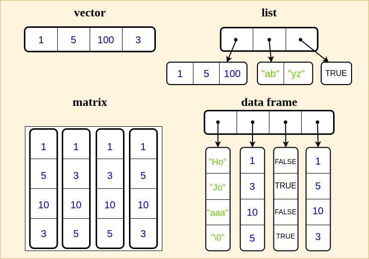

# Strukturierte Datentypen 
 
 Basierend auf den einfachen (atomaren) Datentypen existieren in R
 die folgenden grundlegenden Datenstrukturen.
 
 |Datenstruktur | Beschreibung                                 |
 |:------------ | :------------------------------------------  |
 |vector        | Sequenz gleicher Datentypen                  |
 |matrix        | Verallg. Vektor in 2 Dimensionen             |
 |array         | Verallg. Vektor mit beliebigen Dimensionen   |
 |list          | Sequenz ungleicher Datentypen                |
 |data frame    | Spezielle Liste mit Vektoren gleicher Länge              |
 
Schema:
 
 |Dimension | Homogen   | Heterogen   |  
 |:------   | :-------- | :---------  |
 |1-Dim.    | vector    | list        |
 |2-Dim.    | matrix    | data frame  |
 |k-Dim.    | array     |             |
 
Vektoren und Matrizen sind eine strukturierte Zusammenstellung von Daten gleichen Typs. Ein Vektor kann zum Beispiele eine Reihe von integer Werten bündeln, dann aber keine zusätzlichen logischen Werte oder Zeichenketten aufnehmen. Im Gegensatz dazu erlauben es uns Listen und Data Frames, auch Daten unterschiedlichen Typs zu bündeln. In diesem Kapitel wollen wir uns damit beschäftigen, welche Implikationen die hier skizzierten Eigenschaften der verschiedenen Datenstrukturen für Ihre Anwendung haben.

Damit die Datenstruktur für euch auch visuell an Gestalt gewinnt, folgt eine vereinfachte Darstellung mit den zentralen Eigenschaften der Datenstrukturen. Die Darstellung ist nicht in jeder Hinsicht korrekt, soll aber dazu dienen, die grundlegenden Unterschiede der verschiedenen Datenstrukturen zu veranschaulichen.

 
```{r, echo=FALSE, out.width='70%', fig.align='center', fig.cap="Strukturierte Datentypen"}

```


## Vektoren

Vektoren sind sequentiell geordnete Folgen von Werten *gleichen Typs*. Sie können auf ganz unterschiedliche Art erzeugt werden. 
 
Beispiel: Informationen zum Lineup für die Clubnacht heute. Mit der Funktion `c()` (kurz für 'concatenate' / 'combine').
 
```{r}
DJ_Alter <- c(34, 38, 28, 25, 20)
DJ_Name <- c("DJ Puma", "Cabanne", "Molly", "Echoton", "cv313")
DJ_Vinyl <- c(FALSE, TRUE ,TRUE ,FALSE , FALSE)

DJ_Alter

DJ_Name
DJ_Vinyl
```

**Anmerkung:** Die DJs gibt es wirklich und es lohnt sich mal reinzuhören :). Das Alter und ob die Personen mit Vinyl auflegen oder nicht, ist allerdings frei erfunden.

Ganz einfach können wir Vektoren auch mit dem Colon-Operator `:` erzeugen, welcher Zahlenfolgen mit Inkrement 1/-1 generiert.

```{r}
1:4
countdown <- 10:0
countdown
-1.2:5
```

Allgemeinere Folgen können auch mit `seq()` erzeugt werden:
  
```{r}
seq(from = 1,
    to = 3,
    by = 0.5)
```
  
Auch sehr nützlich:

```{r}
rep(x = c("Nein!","Doch!"),
    times = 3)
```

### Abfragen von Werten durch Subsetting von Vektoren

Mit dem `[]` Operator können einzelne Elemente eines Vektors abgefragt werden. Hier zum Beispiel die Indexposition 2:

```{r}
DJ_Alter[2]
```
 
 
Der Operator ist aber tatsächlich ein "Subset"-Operator und damit 
wesentlich flexibler und sehr mächtig:

```{r}
DJ_Name[c(1, 3)]

DJ_Name[-c(1, 3)]
```

Der Subset-Operator ermöglicht es uns also auch eine Teilmenge des Vektors nach bestimmten Kriterien abzufragen. Hier zum Beispiel die Teilmenge derjenigen Werte, die einen entsprechenden Index haben. Man kann `[]` als einen Operator verstehen, welcher von 
links auf ein Vektorobjekt angewendet wird.

Wird anstelle eines Index ein logischer Vektor (geeigneter Länge) übergeben, so werden alle zugehörigen "wahren" Elemente des Vektors zurückgegeben.

Dies ist tatsächlich eine der häufigsten Verwendungen des Operators (bzw. der Funktion):

```{r}
DJ_Name
DJ_Vinyl
DJ_Name[DJ_Vinyl]
```

### Vektorisierte Operationen

Alle atomaren Datentypen sind tatsächlich Vektoren der Länge eins

```{r}
zahl <- 1
p <- TRUE
name <- "Tom"
  
length(zahl)
length(p)
length(name)
```

Dadurch ist es moglich (fast) alle Operationen, welche für
atomare Datentypen definiert sind vektorisierte anzuwenden, d.h. elementweise für ganze Vektoren:

```{r}
x <- c(1,2,3)
y <- c(2,1,3)

x + y
x + 1
log(x)
DJ_Alter > 21
```

Der letzte Ausdruck wertet elementweise aus, ob das jeweilige Alter größer als 21 ist und bildet das Ergebnis in einem logischen Vektor entsprechender Länge ab.

Zur Illustration der folgenden Beispiele benötigen wir noch einen weiteren numerischen Vektor. Da wir nun wissen, wie man vektorisierte Operationen durchführt, können wir leicht einen Vektor mit den ungefähren Geburtsjahren der Personen aus deren Alter berechnen:

```{r}
DJ_Geburtsjahr <- 2022 - DJ_Alter
DJ_Geburtsjahr
```

### Operationen auf Vektoren

Abhängig vom Datentyp eines Vektors existieren verschiedene Funktionen, die einen Vektor als Argument nehmen und diesen auf ein Ergebnis abbilden.
 
| Operation   | Beschreibung                          
|:------------|:-------------------------------------- 
|`length()`   | Länge eines Vektors                        
|`mean()`     | Durchschnittswert eines num. Vektors       
|`max()`      | Maximum eines num. Vektors
|`any()`      | Ist irgendein Wert eines log. Vektors wahr? 

  
```{r}
mean(DJ_Alter) # numerischer Vektor
any(DJ_Vinyl) # logischer Vektor
```

### Faktoren: ein spezieller Datentyp für kategoriale Daten

Die Klasse `factor` ist in R ein eigener Datentyp, welcher die Typen integer und character derart verbindet, sodass man geeignet kategoriale Variablen (nominal/ordinales Messniveau) repräsentieren kann. Dieser Datentyp ist eine Besonderheit von R und ermöglicht es, einfacher kategoriale Variablen statistisch zu untersuchen.  
Mit der Funktion `factor()` können wir einem Vektor die Menge der möglichen Ausprägungen (`levels`) und deren Bezeichnungen (`labels`) zuordnen.

```{r}
x <- factor(x = c(0, 1, 0, 1),                  # Vektor 
            levels = c(0, 1, 2),                # Mögliche Werte
            labels = c("Mann","Frau","Divers")) # Bezeichnungen 
x
```

Die Werte, die in einem Faktor vorkommen können, werden als `level` bezeichnet und können über die Funktion `level()` abgerufen werden. Es spielt hierbei keine Rolle, ob die Werte tatsächlich in dem Vektor auftreten.

```{r}
levels(x)
```

Die Level werden intern mit Integers repräsentiert. Die `labels` geben Namen für die entsprechenden Levels vor. 

```{r}
as.integer(x)
```

Nicht nur `character`-Vektoren lassen sich in Faktoren umschreiben. Jeder homogene Daten-Vektor kann als Faktor geschrieben werden. Soll dabei auf Labels verzichtet werden, vereinfacht sich das Erstellen:

```{r}
grades <- as.factor(x = 1:6)

grades
```


## Matrizen

 Die Datenstruktur einer Matrix verallgemeinert das Konzept
 des Vektors in zwei Dimensionen. Eine Matrix kann z.B. mittels
 eines Vektors mit der Funktion `matrix()` generiert werden:


```{r}
  M <- matrix(data = 1:9,
              nrow = 3,
              ncol = 3,
              byrow = TRUE)
  M
```

Die Rückgabe gibt uns schon einen Hinweis darauf, wie wir die Matrix "subsetten" können. In den eckigen Klammern ist jeweils der Index vermerkt, welche Zeile bzw. Spalte dargestellt wird.

Die Indizierung erfolgt dann ähnlich zu Vektoren:
 
```{r}
 M[1, 2]
```

Lassen wir ein Argument offen und geben zum Beispiel nur einen Zeilenindex an, evaluiert der Ausdruck entsprechend zur gesamten angegebenen Zeile.
 
```{r}
M[2, ]  
```

Analog kann auch nur das Argument für die Spalte angeben werden:

```{r}
M[, 1]
```

### Benennung von Spalten

Mit der Funktion `colnames()` lassen sich die Spalten
(columns) einer Matrix benennen/ändern sowie auch abrufen.

```{r}
colnames(M) <- c("A", "B", "C")
M
colnames(M)
```
 
Gleiches gilt für die Zeilen einer Matrix mit der Funktion `rownames()`.

Über die Spaltennamen kann nun auch auf die Elemente der Matrix zugegriffen werden:

```{r, }
M[, "B"]
```

### Erzeugung von Matrizen aus Vektoren

Zwei Vektoren können mit der Funktion `cbind()` in eine Matrix überführt werden.

```{r}
D <- cbind(DJ_Alter, DJ_Geburtsjahr)
D
```

Analog können mit `rbind()` zwei Vektoren als Zeilen zu einer Matrix gebunden werden.

**Achtung!** Achtet darauf, dass die beiden Vektoren den gleichen atomaren Datentyp haben, andernfalls wird der "niedrigwertigere" der beiden zum Typ des "höherwertigen" konvertiert. Bindet man z.B. mit der Funktion `cbind()` einen Vektor vom Typ `character` und einen vom Typ `logical`, so erhält man eine Matrix mit *ausschließlich* Werten vom Typ `character`.

## Listen

Eine Liste ist ein "verallgemeinerter Vektor" und lässt als Elemente beliebige Werte oder Datenstrukturen zu:

```{r}
profil_marie <- list(Name    = "Marie", 
                     Freunde = c("Daphne", "Peer"),
                     Alter   = 24)
profil_marie
```

Die Elemente können gleich einen Namen zugeordnet werden. 

### Indizierung von Listen

Die Indizierung von Listen funktioniert etwas anders als bei den homogenen Datenstrukturen, da die Liste eigentlich nur Referenzen auf Objekte sammelt. Wenn wir die einzelnen Objekte für Operationen verwenden wollen, nutzen wir am besten den `$` (Dollar)-Operator. Mit diesem können die Objekte, auf welche die Liste verweist, direkt "angesprochen" werden.

```{r}
profil_marie$Name
profil_marie$Freunde
```

Die Verwendung des mittlerweile altbekannten Subset-Operators ist ebenfalls möglich. Allerdings muss hier immer die verschachtelte Struktur der Liste berücksichtigt werden, was es deutlich komplizierter macht.

Hier ein Beispiel:

```{r}
profil_marie[2]
```

Mit diesem Aufruf erhalten wir einen Verweis, welcher auf einen Vektor zeigt, welcher die Zeichenketten "Daphne" und "Peer" beinhaltet.
 

```{r}
profil_marie[[2]][1]
```

Diese Funktion bezieht sich im ersten Teil `profil_marie[[2]]` nun tatsächlich auf den Vektor, auf welchen die Referenz zeigt. Auf diesen wird anschließend nun noch einmal der Subset-Operator für die erste Position angewandt (`Unser_Vektor[1]`). Auf diese Weise erhalten wir das erste Element des Vektors (was wiederum ein einelementiger Vektor ist).

Deutlich einfacher ist hingegen die Indizierung mithilfe des Dollar-Operators und dem Objektnamen. Der Code wird dadurch wesentlich übersichtlicher:

```{r}
profil_marie$Freunde[1]
```

Falls ihr noch tiefer in das Subsetting von Listen einsteigen wollt, empfiehlt sich das Kapitel "Subsetting" aus dem Buch [Advanced R](https://adv-r.hadley.nz/subsetting.html).

## Data Frames

Die für statistische Zwecke häufigste und wichtigste 
Datenstruktur ist die einer Datentabelle, ein sogenanntes `dataframe`.
 
Diese kann ganz einfach aus Vektoren erzeugt werden:
 
```{r}
df_lineup <- data.frame(Name  = DJ_Name, 
                        Alter = DJ_Alter)
df_lineup
```
 
### Indizierung von Datentabellen                  
 
Das Subsetting funktioniert hier wieder Analog zur Matrix:
 
```{r}
df_lineup[3, ]
df_lineup[, 2]
```

Wie bei den Listen ist es aber auch hier möglich, die Spalten über ihren Namen zu selektieren.
 
```{r}
df_lineup$Name
```
 
 
### Aufnahme weiterer Variablen/Spalten
 
Wie bei den Matrizen auch, können mit der Funktion `cbind()` Vektoren als Spalten eines bereits bestehenden Data Frames aufgenommen werden.

Wie bei Matrizen können Vektoren mit der Funktion `cbind()` als Spalten in einen bestehenden Dataframe eingefügt werden.

```{r}
df_lineup <- cbind(df_lineup, DJ_Vinyl)
df_lineup
```

Alternativ kann eine Spalte ausgewählt werden, die noch nicht existiert, und dann anschließen an einen Vektor gebunden wird. Die Referenz zum Vektorobjekt wird also über den Namen im Dataframe erzeugt.
 
```{r}
df_lineup$Geburtsjahr <- DJ_Geburtsjahr
df_lineup
```
 
 
### Operationen auf Datentabellen
 
Die in einer Datentabelle gespeicherten Objekte können in Funktionsaufrufen verwendet werden.
 
```{r}
mean(df_lineup$Alter)
```

## Prüfe dich selbst

- [x] Du solltest die vier grundlegenden strukturierten Datentypen nennen und unterscheiden können.
- [x] Du solltest wissen, auf welche Weisen du auf die Elemente der unterschiedlichen strukturierten Datentypen zugreifen kannst.
- [x] Du solltest verstanden haben, welche Möglichkeiten es gibt, verschiedene Teilmengen eines strukturierten Datentyps abzufragen.

## Videos zum Kapitel

*Homogene Strukturierte Datentypen* (Vektor und Matrix)

```{r, echo=FALSE}
knitr::include_url("https://videocampus.urz.uni-leipzig.de/paella/ui/watch.html?id=e63004b5-4ef2-46fc-ba20-a60348063d26")
```

*Heterogene Strukturierte Datentypen* (Liste und Dataframe)

```{r, echo=FALSE}
knitr::include_url("https://videocampus.urz.uni-leipzig.de/paella/ui/watch.html?id=a092a446-32c5-4a56-85bb-5f0115e73fd3")
```

## Literaturverweise 

*Ergänzend*

- [R Language Definition](https://cran.r-project.org/doc/manuals/r-release/R-lang.html) Kapitel 2.1 (Nur der Anfang)

*Weiterführend* 

- [Advanced R](https://adv-r.hadley.nz/) Kapitel 3 und 4
- [R-Intro](https://cran.r-project.org/doc/manuals/r-release/R-intro.pdf) Kapitel 5 & 6 (Speziell auch für hier nicht behandelte **Arrays**)
- [Hands-On Programming with R](https://rstudio-education.github.io/hopr/basics.html) Kapitel 5 

<!-- Referenzen  -->

::: {.invisible style="display:none"}
@RLang
@wickham2019advanced
@r-intro
@grolemund2014hands
:::

