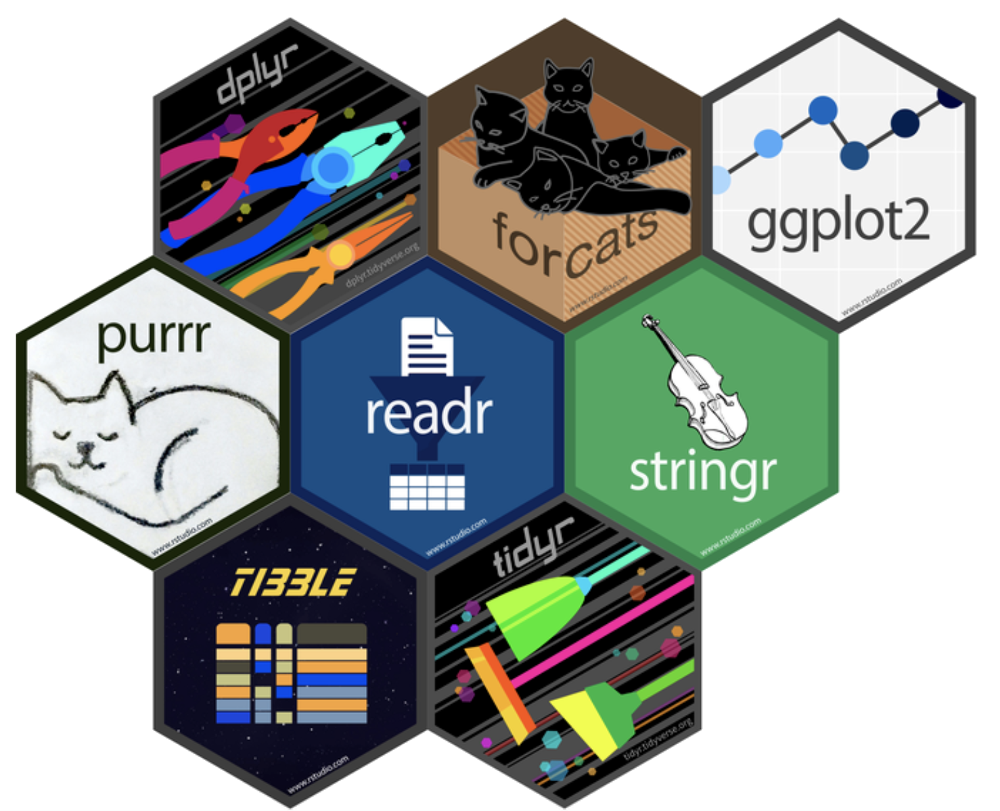

# Tidyverse

In diesem Kapitel wollen wir uns damit auseinandersetzen, was das Tidyverse ist und was für Funktionen die einzelnen Packages des Tidyverse uns bereitstellen. Einen besonderen Fokus wollen wir vor allem erst mal auf die Datenverarbeitung legen, die diese im Regelfall auch die meiste Zeit beansprucht.

## Das "Tidyverse"

Das Tidyverse ist eine Sammlung von Packages, welche einer gemeinsamen Grammatik folgen. Im Folgenden wird ein Package immer durch die doppelten Punkte gekennzeichnet sein, zum Beispiel: `dplyr::`. Das entspricht in R der Syntax, um eine Funktion aus einem bestimmten Package-Scope abzurufen. So können zwei Funktionen zwar den gleichen Namen haben, aber unterschiedlich implementiert sein, wie etwa `dplyr::filter()` und `stats::filter()`, welche in eurem Skript uneindeutig einfach nur `filter()` heißen könnten. Bei solchen Konflikten, ist es ratsam des jeweilige Package, aus welchem man die Funktion aufrufen will *explizit* zu deklarieren, also samt `dplyr::`.

```{r, echo=FALSE, out.width='70%', fig.align='center', fig.cap='Tidyverse Components Logo'}

```

Die Logos der wichtigsten Packages könnt ihr in der Abbildung sehen. Wir werden immer wieder auf einige von diesen zurückkommen und lernen, diese nach und nach anzuwenden. 


### Tidyverse laden

Das Tidyverse ladet ihr wie jedes andere Package auch, also zum Beispiel mit `library()` oder `needs()`. Im Prinzip ladet ihr dabei aber gleich mehrere verschiedene Packages, welche ihr dann nicht im Einzelnen nochmal nachladen müsst.

```{r, message=T, warning=FALSE}
library(tidyverse)
```

Die geladenen Packages werden hier mit der geladenen Version gelistet, sowie auch potenzielle Konflikte.

## `dplyr::`

In dieser Sitzung werden wir uns vornehmlich mit dem Package `dplyr::` beschäftigen. Auf dem entsprechenden [Cheatsheet](https://raw.githubusercontent.com/rstudio/cheatsheets/main/data-transformation.pdf) findet ihr alle Funktionen übersichtlich dargestellt, welche wir jetzt im Detail besprechen wollen.


```{r, echo=FALSE, out.width='30%', fig.align='center', fig.cap="dplyr Logo"}
knitr::include_graphics("resources/dplyr_new.png")
```

*Hinweis:*

Das Packet `dplyr::` erwartet, dass ihr sogenannte "tidy data" vorliegen habt. Das bedeutet, dass *jede Spalte eine Variable* und *jede Zeile eine Beobachtung/Fall* ist (Vergleich auch Cheatsheet oben links). Wie ihr in der Übung sehen werdet, muss das nicht immer der Fall sein und ihr müsst, wenn eure Daten nicht "tidy" sind, diese dann erst entsprechenden anpassen. Dazu gibt es das Package `tidyr::`.


### Daten verfügbar machen

Das Package `dplyr::` ist nicht nur eine Sammlung von verschiedenen Funktionen, sondern beinhaltet auch Datensätze in seinem "Scope". Wenn ihr das Paket geladen habt, könnt ihr auf diese Datensätze zugreifen. Wir wollen für die folgenden Demonstrationen den Datensatz `starwars` aus `dplyr::` verwenden, welcher verschiedene Merkmale von [Star Wars](https://de.wikipedia.org/wiki/Star_Wars) Charakteren umfasst. Über den Zuweisungsoperator können wir den Datensatz auch global verfügbar machen, indem wir ihn an den Namen `starwars` binden.
 
```{r, eval=FALSE}
starwars <- dplyr::starwars
starwars
```
\footnotesize
```{r, echo=FALSE}
starwars <- dplyr::starwars
starwars
```

## Variablen Manipulieren

Die Variablen `starwars$films`, `starwars$vehicles` und `starwars$starships` sind allesamt Listen. Diese sollen heute nicht unser Thema sein, deshalb können wir sie gleich entfernen.

Eine `base::` R Möglichkeit dazu wäre:

```{r, eval=FALSE}
starwars[ ,c("films", "vehicles", "starships")] <- NULL
```

Hierbei verwenden wir den besonderen Datentyp `NULL`, welcher "nichts" symbolisiert (Gar nicht so einfach "nichts" zu benennen).
Indem wir die einzelnen Variablen auf `NULL` setzen, entfernen wir sie aus unserem Datensatz.

Allerdings bringt diese Variante einige Probleme mit sich:

  - schwer zu lesen (Syntaktisch)
  - ungewünschte Objektmanipulation (Kann nicht rückgängig gemacht werden)
  
```{r, echo=FALSE}
starwars <- dplyr::starwars
```
  
  
Eine weitere Möglichkeit unter Verwendung von `base::` R Funktionen wäre:  
  
```{r}
starwars |>
  subset(select = -c(films, vehicles, starships)) |>
  dim()
```
Schon sehr viel besser! 

Allerdings könnte man auf hohem Niveau noch folgende Kritik anbringen:

  - `subset()` kennt keine klare Trennung von Fällen und Variablen (Deswegen müssen wir hier das Argument `select =` explizit angeben)
  - nur bedingt partiell ausführbar (Wir übergeben einen Vektor mit Objekten und nicht deren Namen)

*Anmerkung:*

Im Folgenden wird immer wieder die Funktion `dim()` die Pipes (`%>%`) abschließen. Das dient dazu, die Veränderung zu demonstrieren, ohne den ganzen Dataframe ausgeben zu müssen.


Jetzt noch die `dplyr::` Variante:

```{r}
starwars %>%
  select(!c("films","vehicles","starships")) %>%
  dim()
```
*Anmerkung:*
Im Prinzip könnt ihr in fast jedem Fall die native Pipe und die Tidyverse Pipe synonym zueinander benutzen. Die wechselnde Veränderung in den Codebeispielen soll andeuten, ob wir gerade mit Tidyverse Funktionen arbeiten oder nicht.

Die `dplyr::` Variante sieht zwar sehr ähnlich zum letzten Beispiel aus, ist im Detail aber doch anders. Zum Beispiel haben wir eine extra Funktion `select()` und nicht mehr nur ein Argument einer Funktion `subset(select = ...)`. Also bleiben wir doch voerst dabei!

In den Beispielen haben wir jetzt Variablen entfernt, indem wir die Negation entweder über das `-` oder das logische Symbol `!` vor unseren Vektor gesetzt haben. Natürlich können wir `dply::select()` auch dazu nutzen, um bestimmte Variablen aus einem Dataframe explizit auszuwählen:

```{r}
starwars %>%
  select("height", "eye_color") %>%
  dim()
```
### Neue Variablen erstellen

Mit der Funktion `dplyr::mutate()` können wir neue Variablen erstellen und diese zu unserem Tibble (Dataframe) hinzufügen. Dazu können wir auch bereits existierende Variablen nutzen, was extrem eleganten Code ermöglicht!


```{r}
starwars %>%
  mutate(height_in_meters = height / 100, # Höhe in Meter umrechnen
         index = 1:n() # fortlaufende Nummer
         ) %>%
  dim()
```

Die Funktion `mutate()` fügt immer eine neue Variable zu unserem Dataframe hinzu. Alle anderen Variablen bleiben also erhalten. Im Beispiel oben haben wir zum Beispiel zwei Variablen hinzugefügt `height_in_meters` und `index` und haben jetzt 16 statt den ursprünglich 14 Variablen. Im Gegensatz dazu entfernt die Funktion `transmute()` alle Variablen, die nicht explizit als Argumente angegeben werden. Das ist unter anderem hilfreich, wenn wir einen großen externen Datensatz auf für uns relevante Variablen reduzieren wollen und diese zugleich transformieren wollen.  

### Variablen umbennen

Mit der Funktion `dplyr::rename()` können wir ganz einfach die Variablen umbenennen, diesem Schema folgend:

```{r, eval=FALSE}
starwars %>%
  rename(neuer_name = alter_name,
         ...)
```

Am Beispiel könnte das dann so aussehen:

```{r}
starwars %>%
  rename("height_in_cm" = "height",
         "mass_in_kg" = "mass") %>%
  names() # Gibt die Namen aller Variablen aus
```

Wie man sehen kann, wurden die Namen `"height"` und `"mass"` in die von uns angegebenen neuen Namen geändert.

## Fälle Manipulieren

Der Ausgangsdatensatz hat 87 Fälle. Als Nächstes wollen wir diese Fälle nach gewissen Kriterien filtern. Wenn wir zum Beispiel nur Charaktere mit weißen Haaren betrachten wollten, könnten wir die `dplyr::filter()` Funktion folgendermaßen verwenden:

```{r}
starwars %>%
  filter(hair_color == "white")
```

Wie auch in anderen Funktionen, die wir bereits kennengelernt haben, können wir auch logische Konjunktoren verwenden, um bestimmte Bedingungen auszudrücken:

```{r}
starwars %>%
  filter(homeworld == "Tatooine" & sex != "male")
```
Hier zum Beispiel erhalten wir einen Dataframe, der nur die Fälle beinhaltet, welche aus Tatooine stammen und nicht männlich sind.

**Achtung!**
`filter()` behält nur diejenigen Zeilen (Fälle), über welche definitiv gesagt werden kann, dass sie der angegebenen Bedingung entsprechen und somit "wahr" sind. Alle `NA`-Werte, für welche wir nicht wissen, ob sie wahr wären, werden nicht mit aufgenommen!

### Fälle Gruppieren

Am wohl unscheinbarsten ist die Funktion `group_by()`, da sie unseren Datensatz oberflächlich betrachtet gar nicht verändert.

```{r}
starwars %>%
  group_by(homeworld) %>%
  head(5) # nimm die ersten fünf Fälle
```

Im Hintergrund haben wir unseren Tibble aber um das Attribut `group` ergänzt, welches jeweils die Zeilennummern für die Fälle einer Gruppe als integer Vektor speichert. 

```{r}
starwars %>%
  group_by(homeworld) %>%
  attr("group") %>%
  head(5)
```

Durch das nun zu unserem Datensatz beigefügte Attribut verhalten sich folgende Tidyverse Funktionen teilweise anders. Dies ermöglicht es uns, für die einzelnen Gruppen aggregierte Kennzahlen zu ermitteln:

```{r,}
starwars %>%
  group_by(homeworld) %>% # gruppiere nach homeworld 
  summarise(avg_height = mean(height, na.rm = TRUE),
            n = n()) %>%
  arrange(desc(n)) %>% # absteigend sortiert nach Anzahl
  head(3) # nimm die ersten drei Fälle
```

Die hier verwendete Funktion `summarise()` oder `summarize()` macht es uns nun möglich, Gruppeneigenschaften zu ermitteln. Analog zu `mutate()` können wir so Spalten zu dem resultierenden Dataframe hinzufügen. Auf dem [dplyr:: Cheatsheet](https://raw.githubusercontent.com/rstudio/cheatsheets/main/data-transformation.pdf) findet ihr auf der zweiten Seite unter "Summary Functions" ein paar Funktionen, welche ihr auf die jeweiligen Gruppen anwenden könnt. Im Beispiel haben wir `mean()` benutzt, um das durchschnittliche Gewicht der Gruppe zu ermitteln; `n()` hingegen gibt die Anzahl an Fällen in der Gruppe aus. Zu beachten gilt es, dass alle unbestimmten Werte (`NA`) zu einer Gruppe zusammengefasst wurden. 

Mit `ungroup()` kann das Gruppenattribut wieder entfernt werden. 

Man sollte sich immer vergegenwärtigen, an welchem Punkt man Analysen auf Gruppenebene oder auf Individualebene macht, bzw. ob man mit einem gruppierten Tibble arbeitet oder nicht. 

## Prüfe dich selbst

Von dieser Sitzung solltest du Folgendes mitgenommen haben:

  - [x] Du solltest wissen, was das Tidyverse ist.
  - [x] Du solltest wissen, was "tidy-data" auszeichnet (siehe 8.2). 
  - [x] Du solltest unterscheiden können, mit welchen Funktionen man Fälle und mit welchen man Variablen manipuliert. 
  - [x] Du solltest verstanden haben, was die Funktion `group_by()` macht und wann diese nützlich sein könnte.

## Literaturverweise

*Ergänzend*

- [R for Data Science](https://r4ds.had.co.nz/transform.html) Kapitel 5 (Data Transformation)

*Weiterführend*

- [R for Data Science](https://r4ds.had.co.nz/tidy-data.html) Kapitel 12 (Tidy data), wie sind hier davon ausgegangen, dass "tidy data" vorliegt.

::: {.invisible style="display:none"}
@wickham2016r
:::