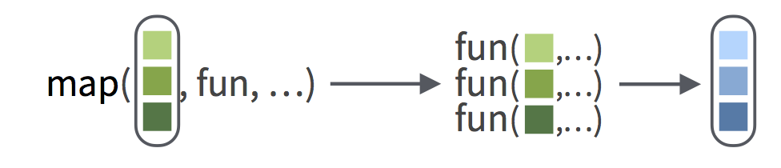

# Kontrollstrukturen{#kontrollstrukturen}

In diesem Kapitel sollen einige Prinzipien der Programmierung vorgestellt werden und gezeigt werden, wie sich diese in R umsetzen lassen. R bietet dabei eine Vielzahl an Möglichkeiten, von welchen einige besprochen werden sollen. 

## Prinzipien der Programmierung

R setzt in großen Teilen die Ideen der funktionalen Programmierung um. Das bedeutet für uns vor allem erst mal, dass ein Großteil der Problemlösung über Funktionen erfolgt. Folgende Prinzipien gilt es zu verinnerlichen, wenn man diese Eigenschaft effizient ausnutzen will:


1. DRY-Prinzip: "Don't repeat yourself". Treten wiederholt gleiche oder
ähnliche Code-Elemente auf, so sollte man diese als Funktion zusammenfassen.

2. "Divide and Conquer"- Prinzip: Oft ist es besser, das Problem oder die Analyse
in verschieden Teilprobleme aufzuteilen und für diese entsprechende Funktionen zu schreiben.

3. "Abstraktion"/Blackbox-Prinzip: Anstelle explizit viele Codezeilen im 
Hauptcode zu listen, welche letztlich gemeinsam eine bestimmte Funktion
erfüllen, ist es besser, diese Komplexität in einer Funktion zu "verstecken".
Black Box: Entscheidend ist *was* die Funktion macht und nicht *wie* sie es 
macht.

Welche Möglichkeiten es gibt, diesen Prinzipien nachzukommen, wollen wir uns jetzt anschauen.

## Funktionen selber schreiben

Funktionen waren schon oft unser Thema. Jetzt wollen wir uns anschauen, wie man selbst eine Funktion schreiben kann. Dies geschieht im Allgemeinen über dieses generelle Schema einer Funktionszuweisung:

```{r, eval=FALSE}
name_function <- function(arg1, ...) {body}
```

- Mit der Funktion `function()` können wir Funktionen erzeugen. :) Man beachte allerdings, dass nach den Klammern `()` noch etwas folgt.
- Funktionen sind auch Objekte und können wie alle anderen Objekte auch an Namen gebunden werden.
- Eine Funktion hat typischerweise Argumentstellen (`arg1, ...`), welche als sogenannte Funktionsparameter an den `body` weitergegeben werden.
- Der `body` oder auch Rumpf der Funktion enthält den Code, welcher beim Funktionsaufruf ausgeführt werden soll.

Eine konkrete Funktionszuweisung könnte dann so aussehen:

```{r}
quadrat <- function (x) {x^2}

quadrat(2) 
```

Die erzeugte Funktion nimmt eine Zahl `x` als Parameter entgegen und berechnet das Quadrat dieser. Da im `body` nichts Abweichendes definiert ist, wird das letzte Objekt zurückgegeben, also das Ergebnis unserer Berechnung. Unser Rückgabewert entspricht also dem Ergebnis der funktion `x^2`.

Optional kann man eine Rückgabe innerhalb des Rumpfes der Funktion auch erzwingen. Dazu verwendet man die Funktion `return()`. Zu beachten gilt es, dass die Ausführung der Funktion beim ersten Aufruf der `return()` Funktion abbricht und folgender Code nicht mehr berücksichtigt wird.

```{r}
quadrat <- function (x) {
  
  y <- x^2
  return(y)
  
  y <- y + 1 
  return(y)
}

quadrat(2)
```

Im gegebenen Beispiel wird alles nach dem ersten `return(y)` nicht mehr ausgeführt. Der Rückgabewert der Funktion entspricht dem Wert des Objektes, welches mit dem Namen `y` verknüpft ist.

Wie wir gerade schon gesehen haben, können wir auch innerhalb von Funktionen Objekte an Namen binden. Dabei gilt es aber zu berücksichtigen, dass wir dabei **kein** Objekt in unserem *Global Environment* anlegen. Die Zuweisung gilt lediglich für den jeweiligen Wirkungsbereich (Scope) der Funktion, also alles, was in den geschweiften Klammern `{...}` steht.

```{r}
x <- 2

quadrat <- function (x) {
  
  x <- x^2
  return(x)
}

quadrat(x) 

x
```

Wie wir hier sehen können, bleibt die globale Zuweisung für den Namen `x` erhalten, trotz der erneuten Zuweisung eines Namens `x` innerhalb der Funktion.

*Anmerkung:*

Um den "Fluss" eurer Funktion nachzuverfolgen, könnt ihr euch Nachrichten auf der Konsole im Funktionsablauf ausgeben lassen. Das ist vor allem praktisch, wenn ihr euch nicht sicher seid, welchen Werte welches Objekt zu welchem Zeitpunkt hat.  

```{r}
x <- 2
quadrat <- function(x) {
  message("Funktion beginnt mir ihrer Arbeit, x ist: ", x)
  x <- x^2
  message("Erste Berechnung erfolgreich, x ist: ", x)
  x
}
quadrat(x)
```

Alternativ könnt ihr eurer Variablen `x` einen konstanten Wert zuweisen, zum Beispiel `x <- 2`, und den `{body}` der Funktion Schritt für Schritt ausführen.

Wenn man einen sogenannten Default-Wert hinterlegt, dann kann eure Funktion auch ohne eine Belegung der entsprechenden Argumentstelle aufgerufen werden:

```{r}
quadrat <- function (x = 10) { x^2 }

quadrat(2)

quadrat()
```

Defaults können sehr nützlich sein, um Komplexität zu verstecken.   

Seit R 4.1.0 gibt es in R einen Shortcut um anonyme Funktionen zu deklarieren:

```{r}
pow <- \(x, y = 2) x^y

pow(2,3)
```
Statt `function` schreibt man einfach `\` und die Klammern des Rumpfes `{}` werden einfach weggelassen. Das ist vor allem dann sinnvoll, wenn man eine Funktion *ad hoc* deklarieren will, zum Beispiel als Argument einer anderen Funktion. Darauf kommen wir später noch einmal zurück. Allerdings kann diese verkürzte Schreibweise auch zur schlechteren Lesbarkeit eures Codes führen.

## Kontrollstrukturen

Kontrollstrukturen dienen der Ablaufsteuerung und sind essenziell für die Konstruktion von Algorithmen:

Folgende Logiken können dabei implementiert werden:

1. Verzweigungen/Fallunterscheidungen: 

  - Falls heute die Sonne scheint, geh in den Park. Falls nicht, dann lerne
für die nächste Klausur. 
 
2. Schleifen:  

  - Solange die Sonne scheint, bleibe im Park.

  - Bestimme alle Quadratzahlen von $1^2$ bis $100^2$. 
  
Ein klassische Fallunterscheidung können wir in R mit einer `if-else` Abfolge umsetzen:

```{r}
x <- 1

if (x > 0) {
  print(paste(x, "ist positiv"))
  } else {
    print(paste(x, "ist nicht-positiv"))
  }
```

Wir setzen hier zunächst x als 1. Danach kommt die logische Abfrage, welche entweder `TRUE` oder `FALSE` sein muss. Ist das Ergebnis `TRUE`, dann wird der Code in den ersten geschweiften Klammern `{print(paste(x, "ist positiv"))}` ausgeführt und die Auswertung bricht ab. Falls das Ergebnis `FALSE` ist, wird der Code in den ersten geschweiften Klammern übersprungen und der `else` Fall wird ausgeführt.

Alternativ können wir `if-else` auch ohne geschweift Klammern schreiben:

```{r}
x <- 1

if (x > 0) 
  print(paste(x, "ist positiv")) else
    print(paste(x, "ist nicht-positiv"))
```
Hierbei gilt es allerdings zu beachten, dass, wenn wir nur die erste Zeile (`if (x > 0)`) ausführen, der restliche Code erst mal nicht berücksichtigt wird. Wir erhalten eine *partiell* ausgeführte Funktion zurück, welche noch weitere Eingaben erwartet. Führen wir die folgenden beiden Zeilen aus, kommen wir zum selben Ergebnis. Was zunächst umständlich erscheint, ist im `body` einer Funktion kein Problem, da dieser sowieso von oben nach unten durchläuft.

Ein Beispiel für eine Funktion mit Fallunterscheidung könnte so aussehen:

```{r}
is.positive <- function(x) {
  
  if (x > 0) {
    return(TRUE)
  } else {
    return(FALSE)
  }
}

is.positive(-1.1)
is.positive(11)
```

Es mal ohne geschweifte Klammern umzuschreiben wäre eine gute Übung!

### Vektorisierte Fallunterscheidungen

Wollen wir `if-else` auf einen Vektor anwenden und erwarten einen Vektor als Ergebnis, müssen wir keine eigene Funktion schreiben. Es existieren bereits vektorisierte `if-else` Funktionen, zum Beispiel aus dem Package `dplyr::`:

```{r}
library(dplyr)

x <- c(1991, 2004, 1988)

if_else(condition = x >= 1981 & x <= 1996,
        true      = "Millennial",
        false     = "kein Millennial")
```

Wenn ihr mehr als zwei Fälle (`TRUE` und `FALSE`) unterscheiden wollt, bietet sich die ebenfalls vektorisierte `dplyr::case_when()` Funktion an. Eine Beispielanwendung dafür könnte die Kategorisierung einer stetigen Variable sein:

```{r}
starwars %>%
  select(name, birth_year) %>%
  mutate(
    age_categorized = case_when(
      birth_year > 200                     ~ "stone_old",
      birth_year <= 200 & birth_year > 100 ~ "old",
      birth_year <= 100 & birth_year > 20  ~ "mid_aged",
      birth_year <= 20                     ~ "young",
      TRUE ~ "other" # catch them all
    ) 
  )
```

*Anmerkung:* Falls euch dieses Zeichen unbekannt vorkommt: `%>%` dann schaut doch noch mal in das Kapitel \@ref(funktionen), dort haben wir Pipes mit der analogen base-R Notation (`|>`) eingeführt.

Im Beispiel wird eine neue Spalte `age_categorized` angelegt, welche eine Kategorisierung des Geburtsalters darstellt. Die einzelnen Fälle, welche in `case_when()` beschrieben werden, sind dabei jeweils durch ein Komma `,` getrennt. Vor der Tilde `~` kommt immer die Bedingung. Dahinter steht, was in diesem Fall passieren soll. Die letzte Bedingung `TRUE` ist immer wahr und greift dann, wenn alle vorherigen Bedingungen zu `FALSE` evaluiert worden sind. In unserem Beispiel fallen darunter alle `NA`-Werte. Die Rückgabe ist ein character-Vektor derselben Länge wie der von der Variable `birth_year`. 


## Schleifen

Schleifen (Loops) dienen dem wiederholten Ausführen eines Anweisungsblocks (loop
body). Es gibt sie in verschiedenen Varianten:

1. `for (i in I) {Anweisung}`

  - Interpretation: Wiederhole Ausdruck für jeden Indexwert `i` in der Indexmenge
 `I`.
 
2. `while (Bedingung) {Anweisung}`

  - Intepretation: Wiederhole `Anweisung`, solange Bedingung erfüllt ist.
 
3. `repeat {Anweisung}`

  - Interpretation: Wiederhole die Anweisung.
  
*Anmerkung:* Zusätzlich lassen sich diese Loops steuern mit `next` (springt zur nächsten
Iteration) und `break` (bricht die Schleife ab).

Wir werden uns hier nur noch der wohl gängigsten Methode, nämlich des `for-loops`, widmen. Schauen wir uns zunächst das einfachste Beispiel für einen `for-loop` an:

```{r}
for (i in 1:10){
  print(i)
}
```

Der `for-loop` iteriert über einen Vektor mit den Zahlen 1 bis 10 und führt den Code in den geschweiften Klammern in jeder Iteration aus. Der Index `i` wird nach jedem Schleifendurchlauf um eine Position inkrementiert. 

Mit diesem Wissen können wir nun einen `for-loop` schreiben, welcher über die Werte eines Vektors iteriert und jeweils den Wert der i'ten Position im Quadrat in einen neuen Vektor schreibt.

```{r}
v1 <- 1:10
v2 <- numeric(length = 10) # leeren Vektor anlegen
     
for (i in 1:10){
  v2[i] <- sqrt(v1[i])
}

v2
```
Da die meisten Funktionen in R bereits vektorisiert sind (`sqrt(v1)`) ist ein `for-loop` nicht immer die beste Variante, manchmal kann er allerdings sehr hilfreich sein.


## Vektorisiertes Programmieren

Vektorisiertes Programmieren bedeutet, dass wir Operationen auf einem Vektor ausführen und dementsprechenden einen Vektor zurückbekommen. Dabei wird eine Funktion auf jedes Element eines Vektors angewandt, was auch eine Möglichkeit ist, iterative Probleme zu lösen. Im letzten Teil wollen wir uns jetzt noch die `purrr::map()` Funktionsfamilie anschauen, welche vektorbasiert funktioniert. Alternativ dazu gibt es im `base`-R die `lapply()` Funktionsfamilie, welche eine ähnliche Intention verfolgt, die wir uns aber nicht mehr anschauen werden können. 


Die Aufgabe, welche wir gerade mit einem `for-loop` gelöst haben, kann man alternativ auch vektorbasiert mit `map()` lösen:

```{r}
library(purrr)
```

```{r}
v1 <- 1:10
map_dbl(.x = v1,
        .f = sqrt)
```
Dabei passiert Folgendes (`fun steht für function`):

```{r, echo= F, out.width='80%', fig.align='center', fig.cap='Quelle: https://tutorials.shinyapps.io/map-intro/_w_543ccdaf/www/images/map.png'}

```

Generell sind die `map()` Funktionen nach diesem Schema aufgebaut:

```{r, eval=FALSE}
map_rueckgabetyp(liste, funktion) 
```

*Wichtig!*: Wenn wir eine Funktion als Objekt übergeben, setzen wir keine Klammern.

Der Rückgabetyp, welchen wir oben im Beispiel verwendet haben, war `dbl`, was einer Fließkommazahl, also im Prinzip `numeric` entspricht. Als erstes Argument übergibt man eine Liste oder besser gesagt einen Vektor. Die Liste ist eigentlich nur ein Sonderfall von verschachtelten Vektoren, weshalb wir auch einen Vektor übergeben können. Richtig nützlich wird `map()` aber erst, wenn man es mit Listen zu tun hat. Das zweite Argument ist eine Funktion, welche über ihren Namen als an `map()` übergeben wird.

Benutzen wir die `map()` Funktion ohne Rückgabetyp, bekommen wir immer eine Liste zurück:

```{r}
map(1:10, log) %>% head(3)
```
Was für Funktionen es alles gibt, ist unter anderem auf dem [Cheatsheet](https://github.com/rstudio/cheatsheets/blob/main/purrr.pdf) zu `purrr::` sehr übersichtlich dargestellt.

Es ist auch möglich, der `map()` übergebenen Funktion noch weitere Argumente zu übergeben. Diese werden `map()` einfach als weitere Argumente übergeben:

```{r}
v1_log <- map_dbl(v1, log)

map_dbl(.x = v1_log, 
        .f = round, 
        digits = 2)
```   
Über sogenannte anonyme Funktionen (welche keinen Namen haben), können wir gleich in der Argumentstelle von `map()`, welche die Funktion entgegennimmt, eigene Funktionen schreiben.

Beispiel:

```{r}
map_dbl(v1, ~ log(.x) %>% round(2))
```

Die Tilde (`~`) zeigt dabei an, dass eine Funktion folgt. Mit `.x` kann man das aktuelle Listenelement ansprechen. Ausgeschrieben könnte die Funktion so ausschauen:

```{r}
un_lambda <- function (x) {
  round(log(x), 2)
}
```

Natürlich könnt ihr die Funktionen auch erst schreiben und dann nur noch über den Namen `map()` als Argument weiter reichen.

Dem Beispiel folgend:

```{r}
map_dbl(v1, un_lambda)
```

Bei diesem Vorgehen empfiehlt es sich, einen aussagekräftigeren Namen für die Funktion zu wählen, welcher auch andeutet, was die Funktion macht.

## Prüfe dich selbst

Von dieser Sitzung solltest du folgendes mitgenommen haben:

  - [x] Du solltest Funktionen in R selber schreiben können.
  - [x] Du solltest Kontrollstrukturen dazu nutzen können, eigene Probleme zu lösen.
  - [x] Du solltest mindestens zwei Möglichkeiten nennen können, wie man in R iterative Probleme lösen kann. 
  - [x] Du solltest verstanden haben, wie vektorisierte Funktionen ausgewertet werden.


